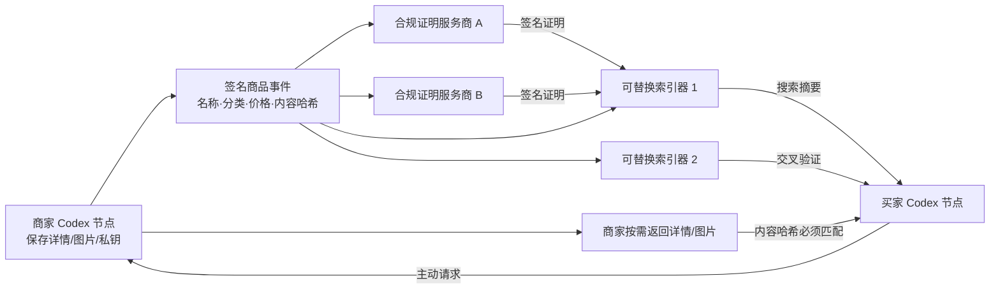

# Codex Market Protocol v0.2

状态：Basic implementation  
目标：平台维护协议，不维护市场；商家保存自己的内容，第三方提供可验证的合规证明，索引节点只保存小型商品事件。

## 1. GitHub 技术参考

| 项目 | 可借鉴能力 | v0.2采用方式 |
|---|---|---|
| [Hypercore](https://github.com/holepunchto/hypercore) | Ed25519签名的Merkle追加日志、稀疏复制 | 事件格式保持“每商家单写者日志”；后续可替换本地传输层 |
| [Autobase](https://github.com/holepunchto/autobase) | 多写者事件因果排序、索引器多数签署检查点 | 预留多索引器和quorum，不在基本版本引入复杂共识 |
| [Rekor v2](https://github.com/sigstore/rekor-tiles) | 低成本、tile-backed透明日志 | 周期性事件根和独立见证者的未来实现参考 |
| [IPFS Kubo](https://github.com/ipfs/kubo) / [CID](https://github.com/multiformats/cid) | 内容寻址与按哈希验证传输 | 黑板只记录SHA-256；内容仍由商家节点提供 |

选择原则：不发币、不挖矿、不要求每个节点保存全量内容，不把模型判断作为协议共识。

## 2. 系统结构



## 3. 基本协议元素

### 3.1 商家身份

- 商家本地生成Ed25519密钥对。
- 私钥永远不上传；商家ID是公钥DER的SHA-256。
- 商家以私钥签署所有商品事件。

### 3.2 商品事件

事件是规范化JSON，最小字段：

```json
{
  "protocol": "cmp/0.2",
  "merchantId": "sha256-public-key",
  "sequence": 2,
  "previous": "previous-event-hash",
  "type": "LISTING_UPDATED",
  "listingId": "merchant-local-id",
  "timestamp": "2026-07-19T00:00:00Z",
  "payload": {
    "name": "Electric toothbrush",
    "category": "personal-care",
    "priceMinor": 16900,
    "currency": "CNY",
    "endpoint": "http://merchant-node.example",
    "contentHash": "sha256-details"
  },
  "eventHash": "sha256-canonical-event",
  "signature": "ed25519-signature"
}
```

更新只能追加。验证节点检查签名、序号、上一事件哈希和商品所有权。撤销使用`LISTING_REVOKED`事件，不覆盖历史。

### 3.3 合规证明

合规服务商同样拥有独立Ed25519身份，对“商品事件哈希 + 内容哈希 + 司法地区 + 规则包版本”签名。

证明结果：

- `PASS`
- `REQUIRES_CONDITION`
- `INSUFFICIENT_DATA`
- `BLOCK`
- `TECHNICAL_RISK`

索引器只接受自己信任的服务商签名；高风险分类可要求多家证明。协议不内置官方模型，也不允许模型输出直接成为全网事实。

### 3.4 商家自托管内容

- 黑板不保存图片和详细描述。
- 商家节点按买家主动请求返回内容。
- 买家验证内容SHA-256是否匹配最新签名事件。
- 商家离线则详情不可用；这是商家的可用性责任。
- 不允许未经请求主动推送大文件。

## 4. 数据所有权和存储

| 数据 | 保存者 |
|---|---|
| 商品详情、图片 | 商家节点 |
| 商家私钥 | 商家节点 |
| 小型签名商品事件 | 商家、索引器、自愿档案节点 |
| 合规证明 | 服务商、索引器、商家 |
| 搜索当前状态 | 任意索引器 |
| 私密订单和地址 | 交易参与方及必要服务方 |

普通索引器无需保存图片。即使一千万商品，每件当前摘要约数百字节，主体仍是GB级；完整历史由自愿档案节点保存并可通过Merkle检查点验证。

## 5. 信任边界

协议能保证：

- 不能冒充商家更新商品；
- 修改旧事件会被发现；
- 换图或换详情会使原证明失效；
- 一个索引器无法改写商家历史；
- 合规结论能追溯到签名服务商、规则版本和证据来源。

协议不能保证：

- 商家永远在线；
- 任意内容永远有副本；
- 某个模型一定正确；
- 交易参与者不受适用法律约束；
- 支付服务商必须支持所有合法交易。

## 6. v0.2验收标准

1. 商家节点在自己的目录生成密钥并创建签名商品事件。
2. 更新事件引用上一事件，修改历史或内容会验证失败。
3. 独立证明服务商签署商品准入证明。
4. 索引器没有有效证明时不展示商品。
5. 买家节点从商家HTTP节点按需获取详情并验证哈希。
6. 商家离线时索引摘要仍存在，但详情请求明确失败。
7. 两个隔离Codex节点可以完成发布、发现、获取和验证测试。
